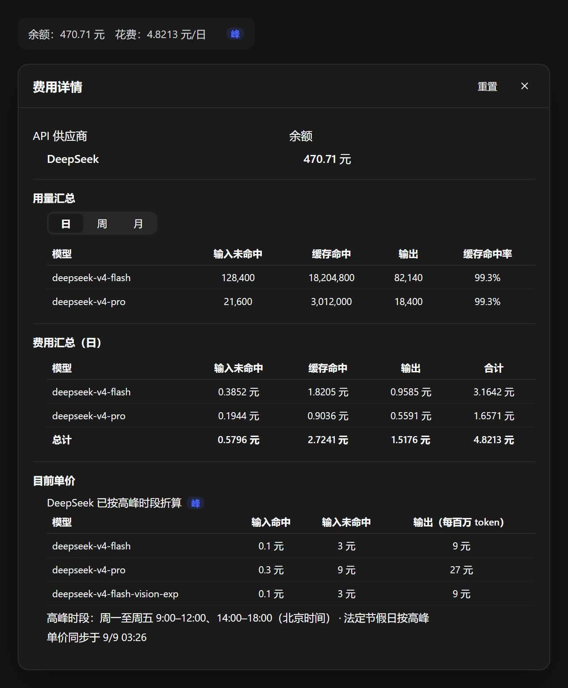

# dsh-ui-balance

**余额与费用：DeepSeek 余额、本次/日/周/月花费、各模型用量与实时单价。**
**Balance and cost panel for DeepSeek Harness: balance, spend, per-model usage, live pricing.**

[DeepSeek Harness](https://github.com/deepseek-ai/deepseek-harness)（下称 dsh）的第三方插件。聊天过程中不用切到网页查账单，侧边栏和弹窗里就能看到。



<details open>
<summary><b>中文</b></summary>

## 前置要求

- dsh `>= 0.1.1-rc.2`
- 已配置 `DEEPSEEK_API_KEY` 凭据
- `pnpm` 可用（`dsh plugin` 底层转发给 pnpm）

## 安装

最省事的办法是用[插件市场](https://github.com/EasyTZ/dsh-market)：打开「发现」，搜 `balance`，点「安装」。

命令行：

```sh
dsh plugin --profile <name> add @easytz/dsh-ui-balance
```

`<name>` 是**必填**的 profile 名，不能省略——桌面版通常是 `web`，TUI 是 `tui`；不确定就看 `$DSH_HOME/profiles/` 下的目录名。想钉死版本就写 `@easytz/dsh-ui-balance@0.6.5`。

装完重启 dsh 即可使用。

## 用法

**侧边栏那一行.** 装完就在侧边栏里，显示账户余额和「本次打开」的花费；最右侧一个绿色「谷」或蓝色「峰」，一眼看清当前是哪个计费时段。

**点开它.** 点侧边栏那一行，弹出费用详情面板，从上到下是：

| 区块 | 看什么 |
|---|---|
| API 供应商 | 当前接入的是谁（DeepSeek / 智谱 GLM / Kimi …） |
| 余额 | DeepSeek、Moonshot(Kimi) 直接查；其他厂商显示「无法查询余额」 |
| 本次打开用量 | 按模型列出输入未命中 / 缓存命中 / 输出 token 与缓存命中率 |
| 用量汇总 | 同样的列，右上角切「日 / 周 / 月」 |
| 费用汇总 | 本次打开（含进行中消息的实时估算）、本日、本周、本月 |
| 目前单价 | 所有已配置模型的价格，统一按每百万 token；峰谷折算后的实际单价 |

**周期怎么算.** 本日 = 当天 00:00–23:59:59，本周 = 周一到周日，本月 = 1 日到月末，都自动跨期清零。多个会话并行时，所有进行中的会话都计入。用量汇总和费用汇总同源——同一个周期、同一批消息，两张表对得上。

**重置.** 标题栏右上角的「重置」清零「本次打开」**加上当前选中的那个周期**（清哪个周期会写在二次确认里）。费用和用量一起清，日 / 周 / 月互不影响。清完立刻落盘，重开应用不会长回来。

## 供应商兼容性

| 供应商 | 余额查询 | 费用统计 | 价格表 |
|---|---|---|---|
| DeepSeek | 支持 | 支持 | 支持 |
| Moonshot / Kimi | 支持 | 支持 | 支持 |
| OpenAI / Claude / Grok / Gemini | 显示「无法查询余额」 | 支持 | 支持（需配置模型单价） |

## 卸载

```sh
dsh plugin --profile <name> remove @easytz/dsh-ui-balance
```

`<name>` 与安装时一致。重启 dsh 后侧边栏那一行消失。

## 已知限制

- 余额查询仅 DeepSeek 和 Moonshot/Kimi 有公开接口；其他厂商需要官方提供余额接口后再适配。
- 价格表数据来自本地配置，建议偶尔核对官方定价页。

## 平台支持

纯 web UI + HTTP 路由，理论上全平台可用；目前主要在 Windows 桌面发行版上验证。

</details>

<details>
<summary><b>English</b></summary>

A third-party plugin for [DeepSeek Harness](https://github.com/deepseek-ai/deepseek-harness) (dsh) that puts your **API balance and spending** in the sidebar, so you never have to open a billing page mid-conversation.

### Requirements

- dsh `>= 0.1.1-rc.2`
- A configured `DEEPSEEK_API_KEY` credential
- `pnpm` available (`dsh plugin` shells out to pnpm)

### Install

Easiest path is the [plugin market](https://github.com/EasyTZ/dsh-market): open **Discover**, search `balance`, hit **Install**.

From the command line:

```sh
dsh plugin --profile <name> add @easytz/dsh-ui-balance
```

`<name>` is **required** — your dsh profile (usually `web` for the desktop/web UI, `tui` for the TUI). Restart dsh afterwards.

### Usage

- **Sidebar row.** Shows your account balance and what this session has cost so far, plus a green "off-peak" / blue "peak" marker for the current pricing window.
- **Click the row** to open the detail panel: provider, balance, per-model token usage for this session, a usage summary you can switch between day / week / month, a cost summary (this session — including a live estimate for in-flight messages — plus today, this week, this month), and the current price table for every configured model, normalised to per-million tokens.
- **Periods** roll over automatically (day at midnight, week on Monday, month on the 1st). Parallel sessions all count toward the same totals, and the usage and cost tables are computed from the same data, so they always agree.
- **Reset** (top right) clears "this session" *plus the currently selected period* — costs and usage together, with a confirmation step naming the period. Day/week/month are independent, and the reset is persisted immediately.

### Provider support

| Provider | Balance lookup | Cost tracking | Price table |
|---|---|---|---|
| DeepSeek | yes | yes | yes |
| Moonshot / Kimi | yes | yes | yes |
| OpenAI / Claude / Grok / Gemini | "unavailable" | yes | yes (configure prices) |

### Uninstall

```sh
dsh plugin --profile <name> remove @easytz/dsh-ui-balance
```

### Limitations

- Only DeepSeek and Moonshot/Kimi expose a public balance endpoint; other vendors need one before support can be added.
- Prices come from local configuration — worth checking against the vendor's pricing page now and then.
- Pure web UI plus HTTP routes, so it should work everywhere; mainly verified on the Windows desktop build.

</details>

## 许可证 / License

[MIT](LICENSE)
